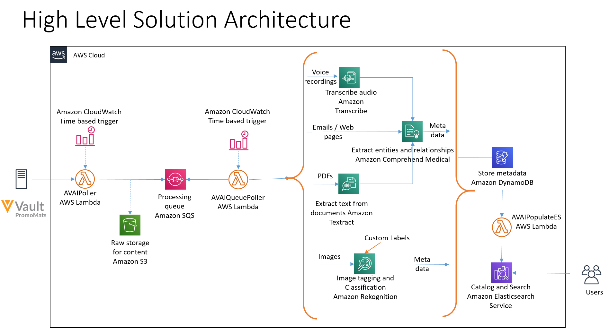

# aws-ai-veeva-integation
A integration between Veeva Vault and AWS, levaraging AWS AI services to intelligently analyze images, PDFs and audio assets.

# Background

This post demonstrates how you can use [Amazon AI services](https://aws.amazon.com/machine-learning/ai-services/) to quickly, reliably, and cost-efficiently analyze the rich content stored in Veeva Vault at scale. The post discusses the overall architecture, the steps to deploy a solution and dashboard, and a use case of asset metadata tagging. 

# Overview of solution
The following diagram illustrates the solution architecture. 



Using the Veeva Vault APIs and the AVAIPoller AWS Lambda function, you set up an inward data flow for Veeva PromoMats, which allows you to get updates on Amazon Simple Storage Service (Amazon S3). These updates could be periodic, event-driven, or batched, depending on your need. The AVAIPoller function handles Veeva authentication and uses an Amazon CloudWatch time-based trigger (every 5 minutes) to periodically call Veeva Vault APIs to ingest data. You can change this frequency by modifying the AWS CloudFormation template provided in this post.

The AVAIPoller function begins by getting all the data for the first run. After that, it just gets the Veeva Vault assets that have been created or modified since the last run.

The function stores the incoming assets on Amazon S3 and inserts a message into an Amazon Simple Queue Service (Amazon SQS) queue. Using Amazon SQS provides a loose coupling between the producer and processor sections of the architecture and also allows you to deploy changes to the processor section without stopping the incoming updates.

A second poller function (AVAIQueuePoller) reads the SQS queue at frequent intervals (every minute) and processes the incoming assets. Depending on the incoming message type, the solution uses various AWS AI services to derive insights from your data. Some examples include:

* **Text files** – The function uses the `DetectEntities` operation of Amazon Comprehend Medical, a natural language processing (NLP) service that makes it easy to use ML to extract relevant medical information from unstructured text. This operation detects entities in categories like Anatomy, Medical_Condition, Medication, Protected_Health_Information, and Test_Treatment_Procedure. The resulting output is filtered for Protected_Health_Information, and the remaining information, along with confidence scores, is flattened and inserted into an Amazon DynamoDB table. This information is plotted on the Elasticsearch Kibana cluster. In real-world applications, you can also use the Amazon Comprehend Medical ICD-10-CM or RxNorm feature to link the detected information to medical ontologies so downstream healthcare applications can use it for further analysis. 
* **Images** – The function uses the `DetectLabels` method of Amazon Rekognition to detect labels in the incoming image. These labels can act as tags to identify the rich information buried in your images. If labels like Human or Person are detected with a confidence score of more than 80%, the code uses the DetectFaces method to look for key facial features such as eyes, nose, and mouth to detect faces in the input image. Amazon Rekognition delivers all this information with an associated confidence score, which is flattened and stored in the DynamoDB table.
* **Voice recordings** – For audio assets, the code uses the `StartTranscriptionJob` asynchronous method of Amazon Transcribe to transcribe the incoming audio to text, passing in a unique identifier as the TranscriptionJobName. The code assumes the audio language to be English (US), but you can modify it to tie to the information coming from Veeva Vault. The code calls the `GetTranscriptionJob` method, passing in the same unique identifier as the TranscriptionJobName in a loop, until the job is complete. Amazon Transcribe delivers the output file on an S3 bucket, which is read by the code and deleted. The code calls the text processing workflow (as discussed earlier) to extract entities from transcribed audio.
* **Scanned documents (PDFs)** – A large percentage of life sciences assets are represented in PDFs—these could be anything from scientific journals and research papers to drug labels. Amazon Textract is a service that automatically extracts text and data from scanned documents. The code uses the `StartDocumentTextDetection` method to start an asynchronous job to detect text in the document. The code uses the JobId returned in the response to call `GetDocumentTextDetection` in a loop, until the job is complete. The output JSON structure contains lines and words of detected text, along with confidence scores for each element it identifies, so you can make informed decisions about how to use the results. The code processes the JSON structure to recreate the text blurb and calls the text processing workflow to extract entities from the text.

A DynamoDB table stores all the processed data. The solution uses DynamoDB Streams and AWS Lambda triggers (AVAIPopulateES) to populate data into an Elasticsearch Kibana cluster. The AVAIPopulateES function is fired for every update, insert, and delete operation that happens in the DynamoDB table and inserts one corresponding record in the Elasticsearch index. You can visualize these records using Kibana.

This solution offers a serverless, pay-as-you-go approach to process, tag, and enable comprehensive searches on your digital assets. Additionally, each managed component has high availability built in by automatic deployment across multiple Availability Zones. For Amazon Elasticsearch Service (Amazon ES), you can choose the three-AZ option to provide better availability for your domains.

# Deployment and Execution

You use the CloudFormation stack to deploy the solution. The stack creates all the necessary resources, including:

* An S3 bucket to store the incoming assets.
* An SQS FIFO queue to act as a loose coupling between the producer function (AVAIPoller) and the poller function (AVAIQueuePoller).
* A DynamoDB table to store the output of Amazon AI services.
* An Amazon ES Kibana (ELK) cluster to visualize the analyzed tags.
* Required Lambda functions:
    * **AVAIPoller** – Triggered every 5 minutes. Used for polling the Veeva Vault using the Veeva Query Language, ingesting assets to AWS, and pushing a message to the SQS queue.
    * **AVAIQueuePoller** – Triggered every 1 minute. Used for polling the SQS queue, processing the assets using Amazon AI services, and populating the DynamoDB table.
    * **AVAIPopulateES** – Triggered when there is an update, insert, or delete on the DynamoDB table. Used for capturing changes from DynamoDB and populating the ELK cluster.
* The Amazon CloudWatch Events rules that trigger AVAIPoller and AVAIQueuePoller. These triggers are in the **DISABLED** state for now. 
* Required IAM roles and policies for interacting AI services in a scoped-down manner.


## Prerequisites

1. Download and install the latest version of Python for your OS from [here](https://www.python.org/downloads/). We shall be using Python 3.8 and above.

2. You will be needing [AWS CLI version 2](https://docs.aws.amazon.com/cli/latest/userguide/cli-chap-install.html) as well. If you already have AWS CLI, please upgrade to a minimum version of 2.0.5 follwing the instructions on the link above.

## Instructions

This code depends on a bunch of libraries (not included in this distribution) which you will have to install yourself.  The code comes with a SAM template, which you can use to deploy the entire solution.

1. Download the contents of this repository on your local machine (say: project-directory)
2. The solution is implemented in python, so make sure you have a working python environment on your local machine.
3. Open a command prompt, navigate to the project directory. Navigate to the /code/lib sub directory and install the following libraries: 
    1. ```bash
        pip install requests_aws4auth --target .
        ```

4. Create a S3 bucket for deployment (note: use the same region throughout the following steps, I have used us-east-1, you can replace it with the region of your choice. Refer to the [region table](https://aws.amazon.com/about-aws/global-infrastructure/regional-product-services/) for service availability.)
    1. ```bash
        aws s3 mb s3://avai-cf-2020-us-east-1 --region us-east-1
        ```

5. Navigate to the /code/source sub directory. Package the contents and prepare deployment package using the following command
    1. ```bash
        aws cloudformation package --template-file CF_Template.yaml --output-template-file CF_Template_output.yaml --s3-bucket avai-cf-2020-us-east-1 --region us-east-1
        ```
6. The SAM template will also create a lambda function which will poll the Veeva domain at regular intervals. Replace the placeholders in the below command with username, password and dbname, and deploy the package:
    1. ```bash 

        aws cloudformation deploy  --template-file CF_Template_output.yaml --capabilities CAPABILITY_IAM  --region us-east-1 --parameter-overrides VeevaDomainNameParameter=demodomainname VeevaDomainUserNameParameter=username VeevaDomainPasswordParameter=password --stack-name AVAI-Demo
        ```
7. If you want to make changes to the Lambda functions, you can do so on your local machine and redeploy them using the steps 5 through 6 above. The package and deploy commands take care of zipping up the new Lambda files (along with the dependencies) and uploading them to AWS for execution.

## Further Reading:
1. Blogpost: [Analyzing and tagging assets stored in Veeva Vault PromoMats using Amazon AI services](https://aws.amazon.com/blogs/machine-learning/analyzing-and-tagging-assets-stored-in-veeva-vault-promomats-using-amazon-ai-services/)

## License

This library is licensed under the Apache 2.0 License. 
